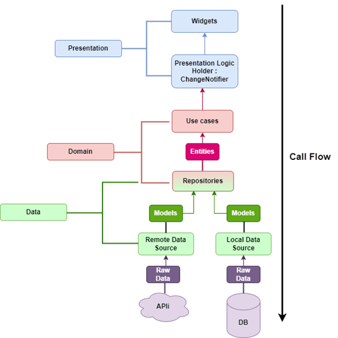

# 88Credit - P2P Lending App

- **Introduce the application:**

  - "88Credit" is a P2P Lending application that connects lenders and borrowers directly. The application is designed to be simple, easy to use, and easy to understand for users. The application is designed with the purpose of helping users to borrow money quickly and conveniently, and to help lenders find borrowers quickly and conveniently.

  - P2P Lending is designed and operated on digital technology platform, in which lenders and borrowers can connect directly with each other instead of via financial institutions.

  - P2P Lending can simplify lending procedures, paperworks and save time in transferring fund. However, it could cause risks to the financial monetary security and stability.


- **List of Features:**
  - User Account Management
  - Ad Posting and Management
  - Loan Request Functionality
  - Fee Payment Processing
  - Contract Generation
  - Chat Functionality
  - Blog Functionality
  - Search Functionality

## Getting Started

To run any Android application built with Flutter you need to configure the enviroments in your machine, you can do this following the the tutorial provided by Google in [Flutter website](https://flutter.dev/docs/get-started/install)

- Nodejs LTS
- Flutter SDK
- Android Studio (to download Android SDK)
- Xcode (for iOS develop only)
- Any IDE with Flutter SDK installed (ie. IntelliJ, Android Studio, VSCode etc)
- A little knowledge of Dart and Flutter

## Technologies

- NestJs
- Flutter
- Clean Architecture
- Bloc
- API with NodeJS backend and Postgre Database
- ZaloPay SDK
- SocketIO

## Setup

1. Clone the repository
2. Open the project in your preferred IDE (e.g. Android Studio, VS Code)
3. Run `flutter pub get` to install the required dependencies
4. Run the project in an emulator or on a physical device

# Backend Architecture


## Front End

- React: A JavaScript framework for building user interfaces for web applications.
- Flutter: Google's SDK for developing mobile applications for iOS and Android.

## API Gateway

- NestJS: A Node.js framework for building API Gateways, providing access points, and managing communication between microservices.
- Nginx: A web server and reverse proxy to manage HTTP and HTTPS traffic.
- Redis: An in-memory database for caching and session management.
Message Queue
- RabbitMQ: A message queue system for managing asynchronous communication between services.

## Microservices

### 88credit Service

- NestJS: A Node.js framework for building the service.
- PostgreSQL: A relational database for data storage.
- Storage Service
- NestJS: A Node.js framework for building the service.
- Cloudinary: A cloud storage service for images and videos.

### Ekyc Service

- NestJS: A Node.js framework for building the service.
- MongoDB: A NoSQL database for storing unstructured data.
- VNPT EKYC: A platform providing EKYC API.

## Chat Service

- NestJS: A Node.js framework for building the service.
- MongoDB: A NoSQL database for storing messages and user information.
- Socket.IO: A JavaScript library for managing real-time communication over WebSocket.

## Docker

- Docker: A containerization tool for packaging and deploying services consistently and easily across different environments.

# Mobile Architecture

The Flutter codebase follows Clean Architecture principles, a design philosophy that emphasizes separation of concerns and maintainability.



# Project stucture

```
// Directory structure for assets and app
- assets:
  - lotties: contains lotifile and animate files
  - icons : contains icon images for usage
  - images: contains app images
  - fonts : contains app fonts (you can using GoogleFont package)
- test: contains test files
- cofig:
    - theme: contains app theme (theme, colors, text styles, etc.)
    - languages: contains app translation (en, vi, etc.)
    - values: contains app values ( strings, image assets)
    - routes
        - app_pages.dart: routes to corresponding pages
        - app_routes.dart: contains names of routes
- core:
    - constants: contains common constants for app (api, etc.)
    - errors: contains error handling (exceptions, failure, etc.)
    - extensions: contains extensions for values in app ( String, DateTime, etc.)
    - network: contains network information (check internet connection, etc.)
    - resources: contains common resources (assets, abstart class of state, etc.)
    - usecases: abstract class for usecases
    - utils: contains common utility functions for app
    - services: implement services for app
- features:
    - data:
        - db: contains database (API, database, firebase, etc.)
        - datasources: contains data sources (local, remote, etc.)
        - models: contains models for data
        - repositories: contains repositories for data
    - domain: contains domain layer (entities, usecases, etc.)
        - enums: contains self-defined enums
        - entities: contains entities for domain
        - repositories: contains repositories for domain
        - usecases: contains usecases for domain
    - presentation: contains presentation layer (pages, widgets, blocs, etc.)
        - global_widgets: contains frequently used widgets in the app
        - <module_name>: named after the functional name
            - screens: contains pages for the feature
            - widgets: contains local widgets only used in this feature
            - <module_name>\_controller.dart: Initializes controller for the feature
            - <module_name>\_binding.dart: Defines functions and variables for controller
- injection_container.dart: contains dependency injection
- main.dart

```

## UseCase Diagram


## ERD Diagram


## Screenshots

<p align="center">
  
  
  
  
  
</p>
<p align="center">
  
  
  
  
  
</p>
<p align="center">
  
  
  
  
  
</p>
<p align="center">
  
  
  
  
  
</p>
<p align="center">
  
  
  
  
  
</p>
<p align="center">
  
  
  
  
  
</p>

# References

[Admin website](https://github.com/nhao2003/88credit_admin)

[Server backend](https://github.com/nhao2003/88credit_server)

[Design Figma](https://www.figma.com/file/wLJ7erR20NcBZAykHSCECy/DoAn1?type=design&mode=design&t=ydI3zN8FajOUapLI-0)
